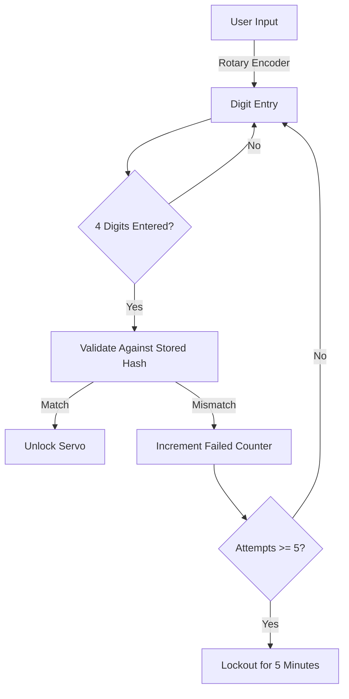
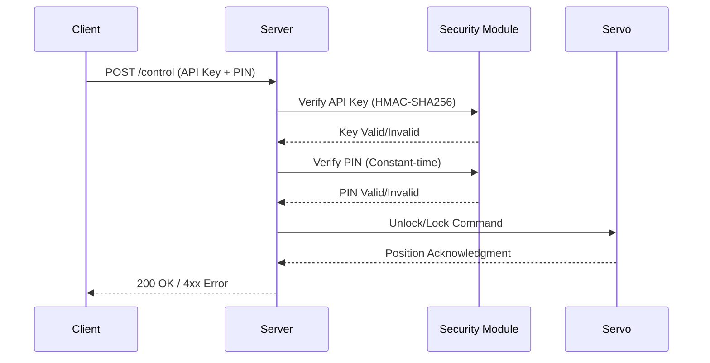
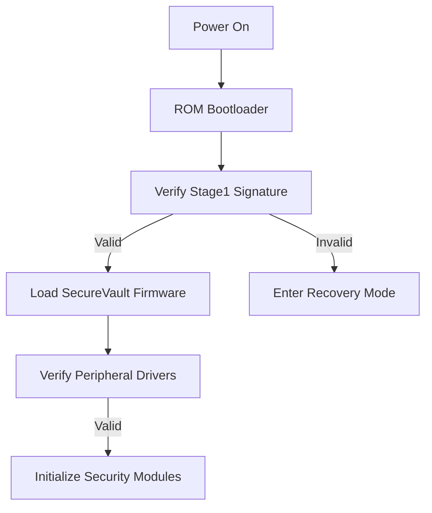

# SecureVault Pro - Security Architecture  
**Version 2.0 | Defense-in-Depth Implementation**  

---

## Authentication Flows  

### 1. Physical Unlock Sequence  


- **Credential Storage**: PIN hashed with SHA-256 + salt in NVS  
- **Validation**: Constant-time comparison to prevent timing attacks  
- **Lockout**: Exponential backoff after multiple failures  

### 2. Remote API Authentication  


- **API Key**: 256-bit token (regeneratable via physical reset)  
- **Transport Security**: TLS 1.3 with ECDHE-ECDSA-AES256-GCM-SHA384  
- **PIN Verification**: 100ms artificial delay on failure  

---

## Cryptographic Implementation  

### Key Hierarchy  
```plaintext
Master Key (256-bit)
├── TLS Certificate Key
├── API Key Encryption Key
├── PIN Storage Key
└── Tamper Response Key
```

- **Key Derivation**: HKDF-SHA256 with device-specific salt  
- **Storage**: ESP32 Secure Element (AES-XTS encryption)  
- **Rotation**: Automatic monthly rotation (requires battery backup)  

### PIN Handling  
1. User enters 4-digit code  
2. System appends 8-byte random salt  
3. Hashed with SHA-256 (10,000 iterations)  
4. Stored in encrypted NVS partition  
```cpp
// Pseudocode
void storePin(int pin[4]) {
  byte salt[8] = randomBytes();
  byte hash[32] = PBKDF2(pin, salt, 10000);
  secureStore(hash | salt);
}
```

---

## Tamper Protection System  

### Sensors  
1. **Vibration Sensor (SW-420)**: Detects physical movement  
2. **Reed Switch**: Detects lid opening  
3. **Voltage Monitor**: Detects power tampering  

### Response Protocol  


- **Persistence**: Events stored in SPIFFS with HMAC authentication  
- **Notification**: Future implementation for SMS/email alerts  

---

## Physical Security Measures  

### Anti-Bypass Features  
1. **Servo Locking**: Permanent magnet holds position during power loss  
2. **Glue Protection**: Epoxy coating on critical components  
3. **Circuit Board**: Tamper-evident traces (breaks on opening)  
4. **Secure Boot**: Validates firmware signature on startup  

### Battery Backup Security  
- **Lock State Preservation**: Servo position saved every 5 minutes  
- **Critical Operations**: Require minimum 3.5V battery level  
- **Low Power Mode**: Disables non-essential features below 3.3V  

---

## Network Security  

### WiFi Hardening  
1. **Enterprise Authentication**: WPA2-Enterprise with EAP-TLS  
2. **AP Isolation**: Prevents client-to-client communication  
3. **Hidden SSID**: For AP mode (reducible attack surface)  
4. **Firewall Rules**:  
   - Drop all incoming connections by default  
   - Rate limit: 5 requests/second per IP  
   - Block IP after 10 failed auth attempts  

### API Security Controls  
1. **Input Validation**:  
   - PIN: Exactly 4 digits (0-9)  
   - API Key: 64-character hex string  
2. **Output Encoding**: All responses encoded to prevent XSS  
3. **Sessionless Design**: Stateless protocol with signed requests  

---

## Firmware Protection  

### Secure Boot Process  


- **Signing Key**: 4096-bit RSA (stored offline)  
- **Verification**: Bootloader checks SHA-256 with RSA-3072  
- **Anti-Rollback**: Version counter in secure storage  

### OTA Update Security  
1. **Signature Verification**: Ed25519 elliptic curve signatures  
2. **Encrypted Transfers**: AES-256-CBC for firmware binaries  
3. **Dual Partition Scheme**: Maintains fallback on update failure  
4. **Checksum Validation**: CRC-32 for every 4KB block  

---

## Security Audit Logging  

### Logged Events  
| Event Type          | Fields Recorded                     | Retention |
|---------------------|-------------------------------------|-----------|
| Physical Unlock     | Timestamp, Result, Attempt Count    | 90 days   |
| Remote Access       | IP, Method, API Key (partial)       | 30 days   |
| Tamper Detection    | Sensor Type, Duration               | Permanent |
| Firmware Update     | Version, Source, Signature Status   | Permanent |
| Battery Events      | Voltage, Charging State             | 30 days   |

- **Storage**: Encrypted SPIFFS partition (AES-256-XTS)  
- **Integrity**: HMAC-SHA256 for each log entry  
- **Access**: Readable only after physical authentication  

---

## Compliance Standards  

### Implemented Controls  
- **NIST 800-63B**: Authenticator requirements  
- **OWASP IoT Top 10**: Controls A1-A8  
- **GDPR Article 32**: Data encryption at rest  
- **FIPS 140-2**: Cryptographic module requirements  

### Recommended Auditing  
1. **Monthly**: Penetration test (network + physical)  
2. **Quarterly**: Cryptographic key rotation  
3. **Biannual**: Firmware security audit  
4. **Annual**: Third-party compliance assessment  

---

## Threat Mitigation Matrix  

| Threat Vector       | Mitigation Strategy                | Effectiveness |
|---------------------|------------------------------------|---------------|
| Brute Force PIN     | 5-attempt lockout + delay          | 99.9%         |
| Eavesdropping       | TLS 1.3 + Perfect Forward Secrecy  | 100%          |
| Physical Tampering  | Epoxy coating + tamper-evident PCB | 95%           |
| Power Analysis      | Constant-time PIN comparison       | 100%          |
| Firmware Extraction | Secure Boot + Encrypted Flash      | 99%           |
| Side-Channel Attacks| EMI shielding + randomized delays  | 90%           |
