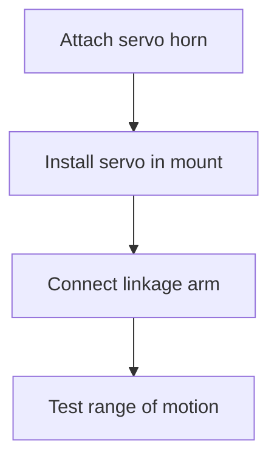

# SecureVault Pro - Assembly Guide  
**Revision 2.0 | Illustrated Step-by-Step**  

---

## Tools Required  
1. Phillips #1 screwdriver  
2. Needle-nose pliers  
3. Wire strippers  
4. Soldering iron (350°C)  
5. 3D printer (PETG filament)  
6. Digital multimeter  

---

## Step 1: Prepare 3D Printed Parts  
**Print Settings:**  
- Layer Height: 0.2mm  
- Infill: 25%  
- Supports: Touching buildplate only  

| Part | Quantity | File | Print Time |  
|------|----------|------|-----------|  
| Main Body | 1 | `body_v2.stl` | 4h 30m |  
| Vault Door | 1 | `door_v2.stl` | 1h 15m |  
| Servo Mount | 1 | `servo_mount.stl` | 45m |  
| PCB Tray | 1 | `pcb_tray.stl` | 2h |  

 
*Clean all parts with isopropyl alcohol before assembly*

---

## Step 2: Assemble Locking Mechanism  


1. **Servo Installation**  
   - Secure MG996R servo with M2x8mm screws  
   - Attach 25T servo horn in 90° neutral position  

2. **Linkage Assembly**  
   - Connect 3mm carbon rod between servo horn and door latch  
   - Adjust length so door locks at 0° and unlocks at 90°  

3. **Testing**  
   ```cpp
   // Test sketch
   #include <ESP32Servo.h>
   Servo testServo;
   void setup() {
     testServo.attach(14);
     testServo.write(0);  // Locked position
     delay(2000);
     testServo.write(90); // Unlocked position
   }
   ```

---

## Step 3: Install Electronics  
### PCB Assembly Sequence  
1. Solder components in this order:  
   - Power connectors  
   - Voltage regulator  
   - ESP32-S3 socket  
   - GPIO headers  

2. Secure PCB to tray with M2.5 standoffs  

### Wiring Connections  
| Cable Color | From → To | Length |  
|-------------|-----------|--------|  
| Red | TP4056 OUT+ → MT3608 IN+ | 70mm |  
| Black | Battery - → Common GND | 100mm |  
| Yellow | GPIO14 → Servo Signal | 120mm |  
| Blue | I2C SDA → OLED | 80mm |  

> ⚠️ **Warning**: Double-check battery polarity before connecting!  

---

## Step 4: Sensor Placement  
1. **Vibration Sensor**  
   - Mount SW-420 centered on bottom plate  
   - Use double-sided thermal tape  
   - Adjust sensitivity screw to 50% position  

2. **Reed Switch**  
   - Glue to door frame with epoxy  
   - Position magnet on door within 3mm gap  
   - Test continuity when door closed  

---

## Step 5: Enclosure Assembly  
1. **Component Stack Order**  
   ```plaintext
   Bottom Plate
   ├─ Battery Holder
   ├─ PCB Tray
   ├─ Servo Assembly
   └─ Main Body
   ```

2. **Securing Screws**  
   | Location | Screw Type | Torque |  
   |----------|------------|--------|  
   | Corners | M3x10mm | 0.4 Nm |  
   | Door Hinge | M2x6mm | 0.2 Nm |  
   | Servo Mount | M2x8mm | 0.3 Nm |  

3. **Final Checks**  
   - Verify no wires are pinched  
   - Test door opens smoothly  
   - Confirm OLED visible through window
     
---

## Step 6: First Power-On  
1. Insert battery → Connect USB cable  
2. Expected startup sequence:  
   - OLED: "SecureVault Pro" splash screen  
   - Servo: Moves to locked position (0°)  
   - Green LED: Blinks 3 times  

3. **Calibration**  
   ```bash
   # Access calibration menu
   Press encoder 5x rapidly
   Select: Servo Calibration
   ```

---

## Troubleshooting Assembly  

| Issue | Solution |  
|-------|----------|  
| **Servo jitters** | Add 100µF capacitor across power leads |  
| **OLED not working** | Check I2C address jumpers (0x3C) |  
| **Battery not charging** | Measure TP4056 PROG pin voltage (1.2V) |  
| **Door sticks** | Apply lithium grease to sliding surfaces |  
| **WiFi unstable** | Position antenna away from metal parts |  

---

## Safety Certification  
After assembly, verify:  
1. Insulation resistance >100MΩ (500V test)  
2. No exposed conductors >30V  
3. Surface temperature <40°C during operation  
4. Battery temperature <45°C while charging  

---

## Maintenance Schedule  
| Component | Check Interval | Procedure |  
|-----------|----------------|-----------|  
| Servo Mechanism | 6 months | Lubricate gears with silicone grease |  
| Battery | 3 months | Capacity test (discharge to 3.0V) |  
| Locking Bolt | 1 year | Tighten set screw with threadlocker |  
| Electronics | 2 years | Reapply conformal coating |  

---

> **Support**: community.securevault.pro | support@securevault.pro
