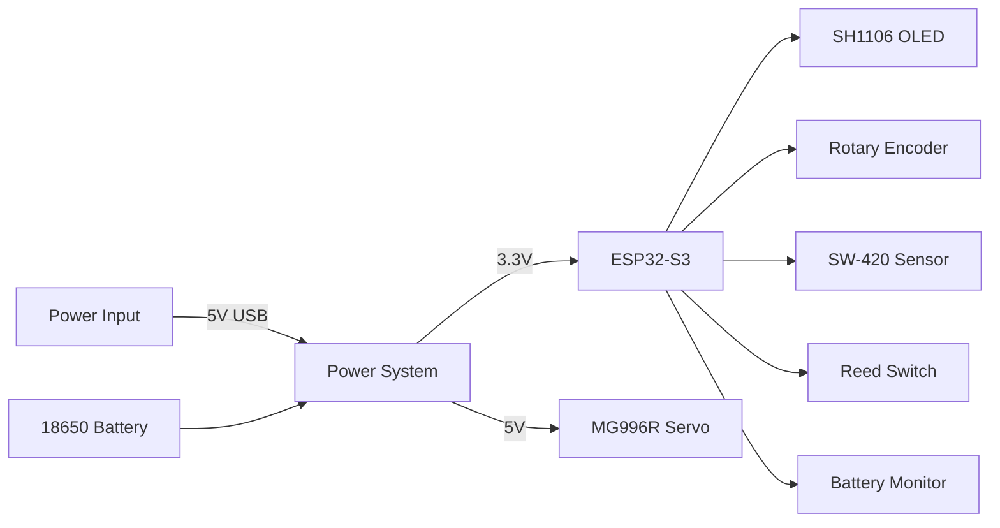
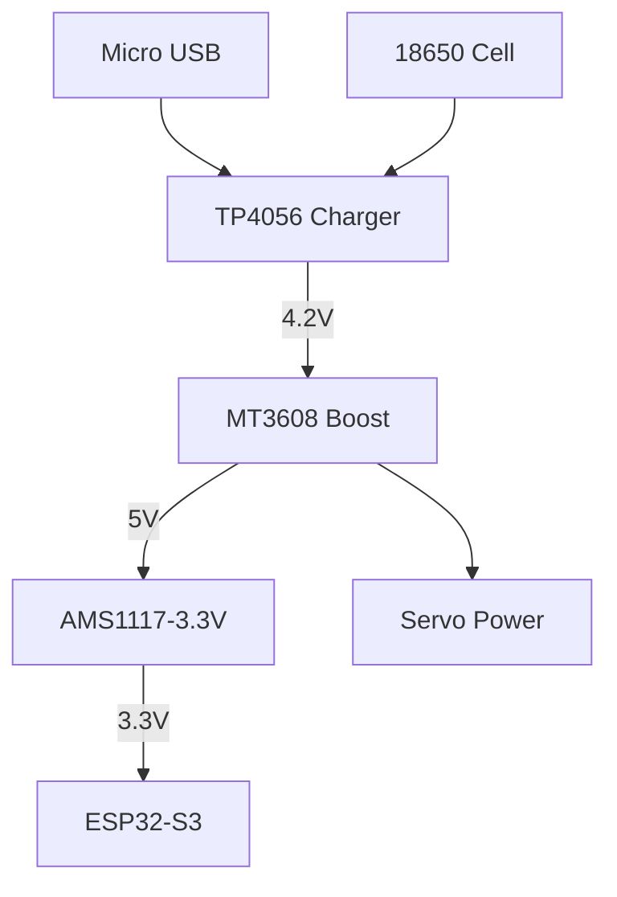

# SecureVault Pro - Electrical Schematics  
**Revision 2.1 | Power-Optimized Design**  

---

## System Block Diagram  


---

## Power Subsystem  


**Component Values**  
| Part          | Value       | Purpose                     |
|---------------|-------------|----------------------------|
| C1, C2        | 100µF 16V   | Input/Output filtering     |
| C3            | 10µF 10V    | 3.3V stabilization         |
| R1            | 1.2kΩ       | Charge current setting     |
| D1            | SS34        | Reverse polarity protection|
| U1            | TP4056      | Battery management IC      |
| U2            | MT3608      | 5V Boost converter         |
| U3            | AMS1117     | 3.3V LDO regulator         |

---

## Microcontroller Connections (ESP32-S3)  

### GPIO Allocation  
| Pin  | Function         | Connection              | Notes                     |
|------|------------------|-------------------------|---------------------------|
| GPIO0| Boot Select      | Pullup (10kΩ)           | Leave floating for JTAG   |
| GPIO21| I2C SDA         | OLED SDA                | 4.7kΩ pullup              |
| GPIO22| I2C SCL         | OLED SCL                | 4.7kΩ pullup              |
| GPIO32| Encoder CLK     | EC11 Pin A              | 10kΩ pullup               |
| GPIO19| Encoder DT      | EC11 Pin B              | 10kΩ pullup               |
| GPIO18| Encoder SW      | EC11 Button             | 10kΩ pullup               |
| GPIO14| Servo Control   | MG996R Signal (Yellow)  | PWM output                |
| GPIO27| Tamper Sensor   | SW-420 OUT              | Active-low interrupt      |
| GPIO34| Battery Monitor | Voltage Divider (100k/220k)| ADC1_CH6               |
| GPIO15| Lid Sensor      | Reed Switch             | Normally open             |
| GPIO13| Status LED      | Red LED + 220Ω          | Anode control             |

---

## Sensor Circuits  

### 1. Tamper Detection (SW-420)  
```plaintext
VCC (3.3V) ──┬───[SW-420]───┬─── GPIO27 (Input)
             │              │
             └──[10kΩ]─────┴─── GND
```

### 2. Lid Sensor (Reed Switch)  
```plaintext
VCC (3.3V) ────[Reed Switch]───┬─── GPIO15 (Input)
                               │
                               └───[10kΩ]─── GND
```

### 3. Battery Voltage Monitor  
```plaintext
BAT+ ───[100kΩ]───┬── GPIO34
                  │
                  └──[220kΩ]─── GND
```

---

## Servo Control Circuit  
```plaintext
ESP32-S3 GPIO14 ───[1kΩ]───┬── Servo Signal
                           │
                           └──[2N2222 Base]
                           
Servo VCC ───[100µF]───┬── 2N2222 Collector
                       │
                       └── Servo Power
                           
Servo GND ───────────── GND
```

**Transistor Biasing**  
- Base Resistor: 1kΩ  
- Flyback Diode: 1N4149 across servo power pins  
- Decoupling Capacitor: 100µF electrolytic  

---

## PCB Layout Guidelines  
1. **Power Planes**  
   - Dedicated ground plane (Layer 2)  
   - Star topology for power distribution  

2. **Critical Traces**  
   | Signal          | Width | Length Constraint |  
   |-----------------|-------|-------------------|  
   | Servo Power     | 30mil | < 50mm            |  
   | I2C Lines       | 10mil | < 100mm           |  
   | Encoder Signals | 10mil | < 80mm            |  

3. **Component Placement**  
   - Servo driver near edge connector  
   - Battery management ICs away from analog sensors  
   - ESP32 antenna area clear of metal components  

---

## Safety Features  
1. **Overcurrent Protection**  
   - PTC Fuse (500mA) on battery input  
   - Resettable fuse on servo power rail  

2. **ESD Protection**  
   - TVS Diodes on all external connections  
   - Spark Gaps on USB data lines  

3. **Thermal Management**  
   - Thermal vias under boost converter IC  
   - 2oz copper for power traces  

---

## Revision History  
| Version | Changes                     | Date       |  
|---------|-----------------------------|------------|  
| 1.0     | Initial Release             | 2025-01-15 |  
| 2.0     | Added battery backup        | 2025-04-22 |  
| 2.1     | Improved EMI filtering      | 2025-07-10 |  

---

## Manufacturing Notes  
1. **PCB Specifications**  
   - Layers: 2  
   - Material: FR-4 Tg170  
   - Finish: ENIG (1μm)  
   - Silkscreen: White  

2. **Assembly**  
   - Reflow Profile: Lead-free (Peak 245°C)  
   - Conformal Coating: Acrylic IPC-CC-830  

3. **Testing**  
   ```test
   1. Power-On Test: Verify 3.3V/5V rails
   2. ISP Programming: Flash bootloader
   3. Functional Test: Servo sweep + sensor check
   4. Burn-in: 72hrs @ 45°C
   ```

For fabrication, use [JLCPCB Standard Stackup](https://jlcpcb.com/capabilities/Capabilities) with impedance-controlled routing for USB lines.
